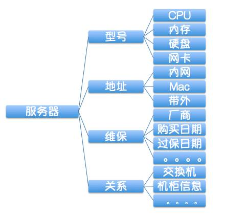
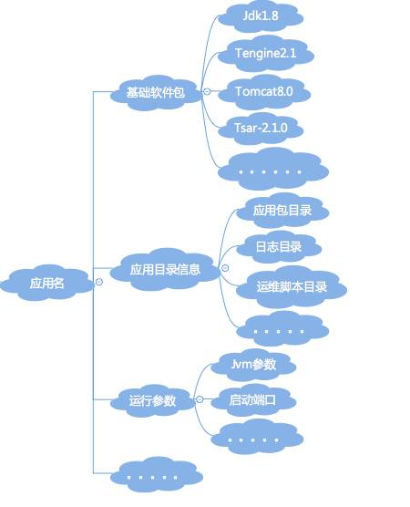
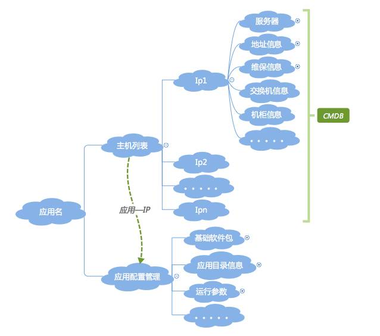

# CMDB与应用配置管理

**CMDB是面向资源的管理，应用配置是面向应用的管理。 **

## CMDB：面向资源

通常，我们在建设运维的基础管理平台时，通常要做的事情：

* 维度：服务器、网络、IDC、机柜、存储、配件等；
* 硬件的属性：比如服务器就会有SN序列号、IP地址、厂商、硬件配置（如CPU、内存、硬盘、网卡、PCIE、BIOS）、维保信息等等；网络设备如交换机也会有厂商、型号、带宽等等；
* 信息之间的关联关系（拓扑关系）：比如服务器所在机柜，虚拟机所在的宿主机、机柜所在IDC等简单关系，复杂一点就会有核心交换机、汇聚交换机、接入交换机以及机柜和服务器之间的级联关系，这个就相对复杂一些
* 规划问题：比如，IP地址段的规划，xx网段用于DB，xx网段用于大数据、xx网段用于业务应用等等，再比如同步要做的还有xx机柜用于做虚拟化宿主机、xx机柜只放DB机器等等。

## 应用配置管理：面向应用

应用会涉及到的信息：

* 应用基础信息，如应用责任人、应用的Git地址等
* 应用部署涉及的基础软件包，如语言包（Java、C++、GO等）、Web容器（Tomcat、JBoss等）、Web服务器（Apache、Nginx等）、基础组件（各种agent，如日志、监控、系统维护类的tsar等）
* 应用部署涉及的目录，如运维脚本目录、日志目录、应用包目录、临时目录等
* 应用运行涉及的各项脚本和命令，如启停脚本、健康监测脚本
* 应用运行时的参数配置，如Java的jvm参数，特别重要的是GC方式、新生代、老生代、永生代的堆内存大小配置等
* 应用运行的端口号
* 应用日志的输出规范

## CMDB和应用配置管理的关系

如果仅仅基于CMDB的资源信息作自动化，最多只能做出自动化的硬件资源采集、自动化装机、网络-硬件拓扑关系生成等资源层面的工具，这些工具只会在运维层面产生价值，离业务还很远，就更谈不上能给业务带来什么价值了。但是基于应用这一层去做，就可以做很多事情，比如持续集成和发布、持续交付、弹性扩缩容、稳定性平台、成本控制等等，这些事情，带来的价值就会大大不同。

内容来源： [有了CMDB，为什么还要应用配置管理](http://www.yunweipai.com/archives/21160.html)

